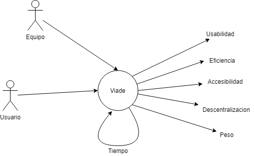

[[section-quality-scenarios]]
== Quality Requirements
Alejandro Iglesias Calvo <uo247346@uniovi.es>;

[role="arc42help"]
****

.Content/contenido
Los requisitos de calidad se iran ampliando durante el proyecto.

La pagina debe ser funcional, rapida y accesible.
Es importante que los tiempos de carga sean minimos, aunque la parte mas pesada del trabajo es tarea de la conexion a internet del usuario.

.Motivation/Motivación
Planteamos nuestros criterios de calidad en funcion de nuestra experiencia, las pruebas, y el feedback de la comunidad.
Se buscan los siguientes puntos:
Usabilidad, eficiencia, accesibilidad, descentralización y peso de la app.
****

=== Quality Tree/Arbol de calidad

[role="arc42help"]
****
.Content

.Explicacion
En este mapa mental podemos observar nuestra "filosofia" de trabajo. +
A lo largo del tiempo, y usando nuestra propia experiencia, mejoraremos la aplicacion y la usabilidad. +
Un proceso constante de autoevaluacion nos ayudará a proporcionar una mejor experiencia a usarios y futuros desarolladores.
****
=== Quality Scenarios/Escenarios de calidad

[role="arc42help"]
****
.Contents/Contenidos
Escenarios de calidad, estos pueden cambiar

.Escenarios de uso
|===
| *Uso*  | *Explicación*

| *Lanzamiento de la app*
| La aplicacion debe ser de facil acceso
| *Lanzamiento de la app*
| La aplicacion debe ser de facil acceso
| *Accesibilidad*
| La aplicacion debe ser apta para el mayor numero de personas posibles.
|===

.Escenarios de cambio
|===
| *Cambio*  | *Explicación*
| *Aun no tenemos cambios*
| -----
|===
****
